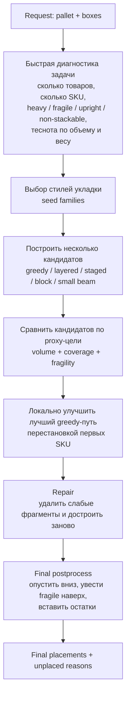
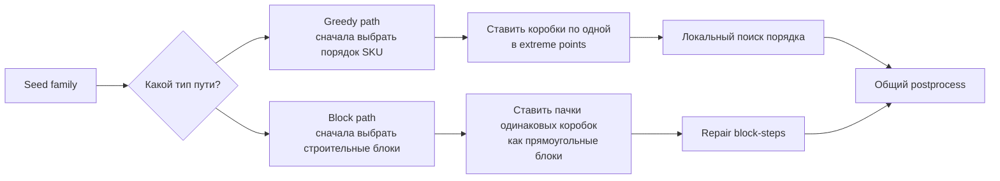

**Главная идея**
Этот solver не пытается найти "идеальную укладку" одним методом. Он работает как короткий runtime-портфель: сначала быстро понимает, что за заказ пришёл, потом выбирает 2-3 наиболее подходящих стиля укладки, строит несколько решений разной природы, локально улучшает лучшие и только потом отдаёт финальную раскладку.

**Из каких принципиальных компонентов он состоит**

1. `Dispatcher`. Снаружи есть 3 режима: default `portfolio_block`, `legacy_hybrid`, `legacy_greedy`. На практике основной алгоритм сейчас именно `portfolio_block`.
2. `Request fingerprint`. Это не "модель", а дешёвый диагноз геометрии заказа: много ли товаров, доминирует ли один SKU, насколько груз тяжёлый, сколько upright/fragile/non-stackable, насколько заказ близок к переполнению паллеты.
3. `Selector`. По fingerprint solver выбирает не конкретные координаты, а порядок "семейств стратегий". То есть ML тут отвечает за выбор хорошего стиля решения, а не за само размещение.
4. `Constructive engines`. Дальше работают уже детерминированные укладчики: greedy-пути, специальные layered/column варианты, block-based конструктивный путь, маленький beam-кандидат для некоторых маленьких diverse-case задач.
5. `Shared geometric state`. Все пути опираются на одну идею: паллета хранится как множество уже поставленных AABB-боксов + фронтир свободного пространства в виде extreme points.
6. `Feasibility gate`. Любой кандидат сначала проходит жёсткие проверки: границы, вес, коллизии, опора, upright, запрет ставить на non-stackable, heavy-on-fragile.
7. `Proxy objective`. Во время поиска solver оптимизирует не финальный официальный score один в один, а его быстрый proxy: объём, покрытие, fragility. Это нужно, чтобы сравнивать частично построенные решения.
8. `Repair + postprocess`. После конструктивной стадии решение ещё не считается "готовым": его уплотняют, переставляют fragile-боксы безопаснее и пытаются дозаполнить пустоты.

**Как работает default solver**

1. Он не стартует с координат, а с ответа на вопрос: "какой тип укладки здесь вообще уместен?"
2. Если заказ похож на тяжёлый/повторяющийся, приоритет получают одни seed family; если он fragile/upright/низкий по высоте, другие; если есть ML-selector, он лишь подмешивает своё мнение к fallback-эвристике, а не заменяет её.
3. Из 6 seed family solver обычно реально пробует только верхние 2-3. Это ключевой принцип экономии времени: не искать везде, а быстро проверить несколько осмысленных направлений.
4. Для greedy-family он задаёт порядок SKU и укладывает товары по одному. Для block-family он пытается ставить сразу прямоугольные блоки одинаковых товаров.
5. Для специальных паттернов он включает узкие подалгоритмы: например, для upright-heavy случаев послойную укладку, для fragile-heavy случаев staged-последовательности, для маленьких разнородных кейсов маленький beam.
6. После этого он берёт лучший greedy-кандидат и делает локальный поиск по первым SKU: не меняет весь план целиком, а ищет, не даст ли другая ранняя перестановка сильно лучший старт.
7. Затем ремонтирует только лучшие 1-2 решения: удаляет слабые куски, перестраивает их, отдельно чинит fragile-конфликты и пробует remove-and-refill.
8. В самом конце ещё раз запускает postprocess и отдаёт уже внешнее решение в формате placements/unplaced.

**Два разных "мотора" внутри default solver**

**Что такое extreme points и почему это центр всей геометрии**
Solver не хранит "всё свободное пространство" целиком. Он хранит только перспективные точки старта для новых коробок: у правой грани, у задней грани и сверху уже поставленных объектов. Это сильно упрощает поиск:

- вместо непрерывного перебора по всему объёму он проверяет небольшой фронтир
- каждая новая коробка рождает новые точки-кандидаты
- высота в точке не берётся "из воздуха", а проецируется на ближайшую опорную поверхность

Именно поэтому pipeline выглядит как повторяющийся цикл: "сгенерировать feasible-кандидаты -> оценить -> поставить лучший -> обновить frontier".

**Чем greedy-путь отличается по смыслу от block-пути**
Greedy-путь хорош, когда качество определяется порядком SKU: что поставить раньше, какие коробки создать как опору, что увести наверх, как разыграть constrained-грузы. Это стратегия "строить сцену item-by-item".

Block-путь хорош, когда выгодно мыслить не коробками, а мини-паллетами из одинаковых товаров: 2x2x3 одинаковых бокса, компактный столб, прямоугольная платформа. Это стратегия "строить крупными устойчивыми кирпичами", а не мелкими шагами.

**Почему тут два ML-слоя, и почему это не "нейросеть, которая пакует"**

- `Scenario selector` работает на уровне всего заказа: он говорит, какой стиль решения вероятнее сработает лучше.
- `Block ranker` работает на уровне микро-решений внутри block-path: из нескольких допустимых блоков подсказывает, какой из них перспективнее.

Оба слоя только ранжируют варианты. Ни один не имеет права нарушать геометрию: сначала проходит feasibility, потом уже scoring/ML.

**Что делает postprocess на человеческом языке**
Postprocess — это не "ещё один solver", а санитарная обработка уже найденного решения:

- опустить коробки вниз, если под ними есть лишний зазор
- поднять fragile-груз в более безопасный порядок
- после перепаковки попробовать снова вставить часть unplaced-коробок в освободившиеся карманы

То есть конструктивная стадия строит хороший черновик, а postprocess доводит его до более плотной и безопасной версии.

**Как понимать весь solver одной фразой**
Это не "алгоритм оптимального 3D packing", а многошаговый meta-solver:

- быстро классифицировать заказ
- выбрать несколько стилей построения
- грубо построить несколько решений
- локально улучшить лучшие
- безопасно дочистить геометрию в конце

**Как solver думает на примере одного реального request**
Возьмём реальный файл [`request_fragile_cap_mix.json`](../request_fragile_cap_mix.json). Это хороший пример, потому что здесь одновременно есть:

- почти полный объём паллеты: `volume_ratio ~= 0.99`
- много upright-груза: `upright_ratio ~= 0.81`
- много fragile-груза: `fragile_ratio ~= 0.45`
- заметная доля `stackable=false`: `non_stackable_ratio ~= 0.26`
- всего `69` коробок и `4` SKU, то есть кейс не гигантский, но уже достаточно "злой"

Сами SKU у этого request такие:

- `SKU-CANNED-7667`: `38` коробок, низкие, тяжёлые, `strict_upright=true`, но **не fragile**
- `SKU-WINE-2325`: `12` коробок, `strict_upright=true`, `fragile=true`, `stackable=false`
- `SKU-EGGS-7172`: `6` коробок, `strict_upright=true`, `fragile=true`, `stackable=false`
- `SKU-CHIPS-6807`: `13` коробок, лёгкие, объёмные, `fragile=true`

На человеческом языке solver видит картину так: "паллета почти забьётся целиком; почти всё надо держать upright; часть fragile-груза нельзя использовать как несущую платформу; значит нельзя просто жадно запихнуть максимум коробок любой ценой".

**Шаг 1. Быстрый диагноз request**
По fingerprint этот кейс попадает сразу в несколько режимов:

- `low_ceiling_pressure = True`, потому что upright-груза много и коробки не совсем плоские
- `coverage_supported = True`, потому что заказ почти заполняет паллету
- `repeat_heavy = True`, потому что коробок много (`69`) при всего `4` SKU
- `strict_safe_selection = True`, потому что это near-fit кейс с `upright/non-stackable`
- `_should_add_strict_fragility_run = True`, потому что в request есть тяжёлые fragile SKU

Из этого solver делает практический вывод: нужно экономить runtime и проверять не всё подряд, а только пару самых осмысленных направлений, плюс отдельно прогнать "осторожный fragile-режим".

**Шаг 2. Какие seed family он реально запускает**
Для этого request fallback ranking даёт такой порядок:

1. `coverage_tie`
2. `heavy_base`
3. `liquid_fill`
4. `mixed_volume`
5. `fragile_density`
6. `block_structured`

Но из-за `repeat_heavy = True` solver не идёт по всем шести вариантам. Он реально пробует только верхние `2` family:

1. `coverage_tie`
2. `heavy_base`

И отдельно добавляет ещё один специальный прогон:

1. `fragile_density` c `strict_fragility=True`

То есть мысль не "перебрать всё", а "быстро сравнить 2 базовых гипотезы и 1 безопасный special-case".

**Шаг 3. Какой порядок SKU он считает разумным**
Для безопасных greedy-run'ов solver приходит к порядку:

1. `SKU-CANNED-7667`
2. `SKU-WINE-2325`
3. `SKU-EGGS-7172`
4. `SKU-CHIPS-6807`

Почему именно так:

- сначала низкие не-fragile банки, чтобы построить хорошее основание
- потом fragile upright wine, которые нельзя использовать как "нижний бетонный слой"
- потом яйца, которые ещё более капризны по опоре и по footprint
- чипсы уходят в конец, потому что они объёмные и fragile, но не помогают строить несущую структуру

Это и есть типичное "мышление" solver: сначала создать устойчивую геометрию, а уже потом добирать мягкие и неудобные SKU.

**Шаг 4. Что даёт локальный поиск порядка**
После первого прохода solver не останавливается. Он делает local order search по первым SKU и находит более агрессивный вариант:

1. `SKU-CHIPS-6807`
2. `SKU-CANNED-7667`
3. `SKU-WINE-2325`
4. `SKU-EGGS-7172`

Этот порядок даёт более высокий сырой proxy-score и даже больше размещений:

- safe run: `51` коробка, `fragility_score = 1.0`
- aggressive run after local search: `58` коробок, но `fragility_score = 0.4`

Именно здесь видно, что solver не равен "поставить как можно больше штук". Он сначала радуется более плотному кандидату, но потом задаёт второй вопрос: "а не стал ли этот кандидат слишком опасным для fragile-груза?"

**Шаг 5. Почему финал выбирается не по максимальному proxy-score**
Для near-fit + upright/non-stackable кейсов включается safe-pool логика: в финальный выбор попадают только run'ы с достаточно хорошим fragility quality.

Поэтому aggressive local-order кандидат с `58` коробками **отбрасывается**, хотя по сырому proxy он лучше. В safe pool остаются только run'ы с `fragility_score >= 0.95`, и среди них побеждает осторожный вариант.

Итоговый ответ solver на этом request:

- placed: `51`
- unplaced:
  - `SKU-CHIPS-6807`: `13`
  - `SKU-EGGS-7172`: `5`
- причина по факту: не нарушение hard-constraint в уже поставленных коробках, а то, что после безопасной раскладки свободные карманы больше не подходят под оставшиеся fragile SKU

По составу safe-решение выглядит так:

- `38` банок
- `12` wine-case
- `1` коробка яиц

То есть solver в этом примере мыслит примерно так:

1. "Сначала соберу надёжное основание из не-fragile низких SKU".
2. "Потом аккуратно поставлю upright fragile-груз, который нельзя использовать как опору".
3. "Если более плотный порядок резко портит fragility, я лучше оставлю часть товара unplaced, чем протащу рискованный план в финал".

Это хороший пример того, что `portfolio_block` оптимизирует не один показатель, а баланс между плотностью, покрытием и безопасностью раскладки.
